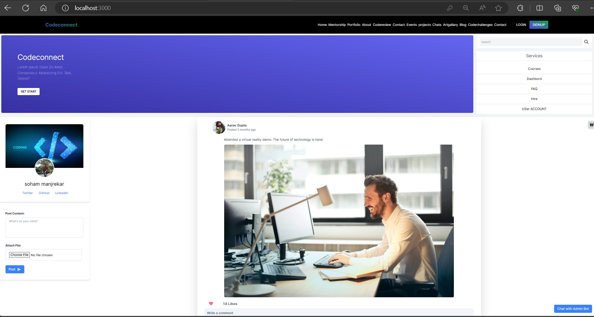
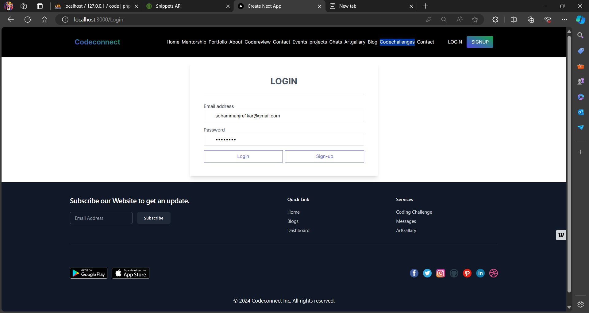
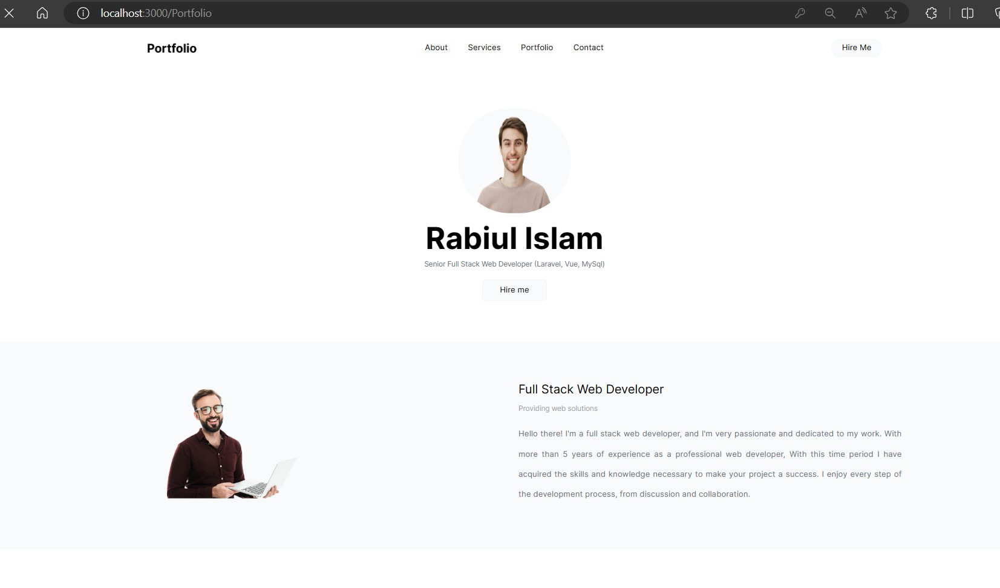
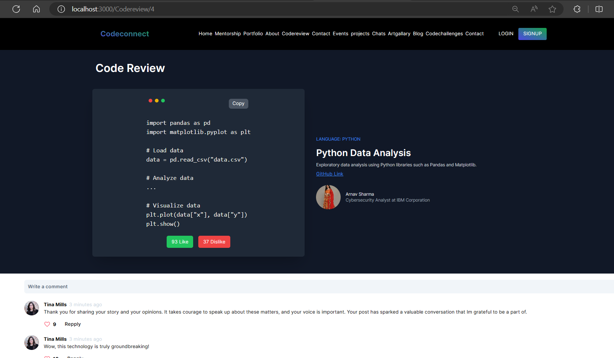
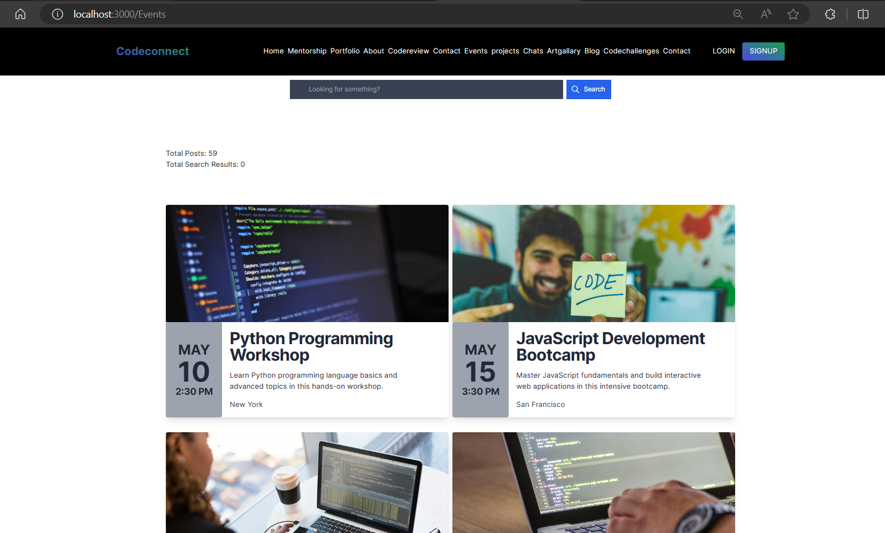
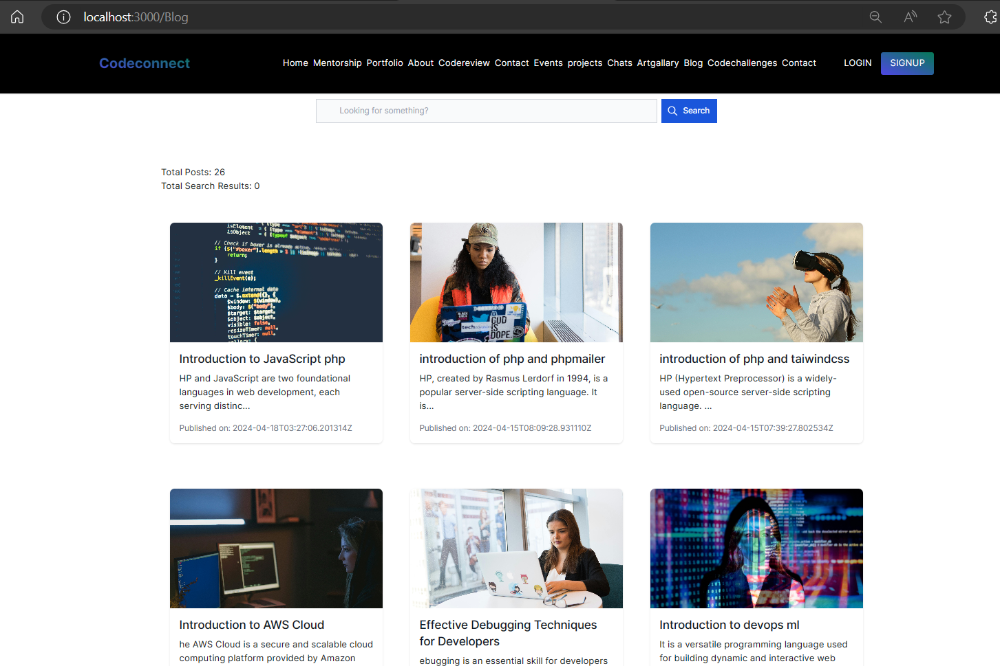
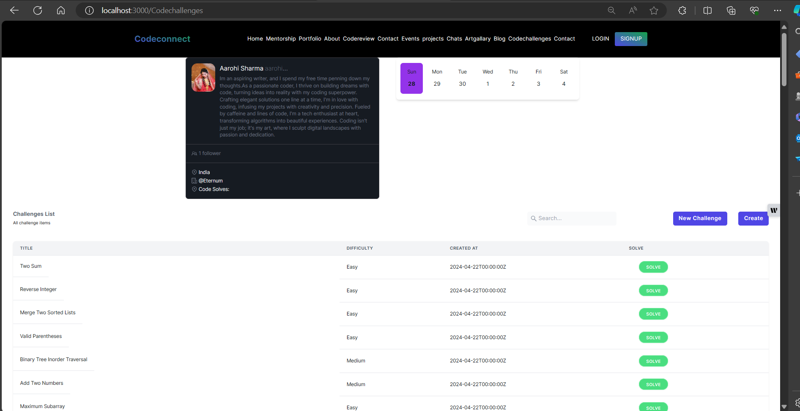
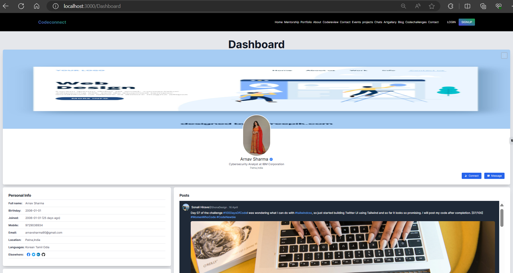
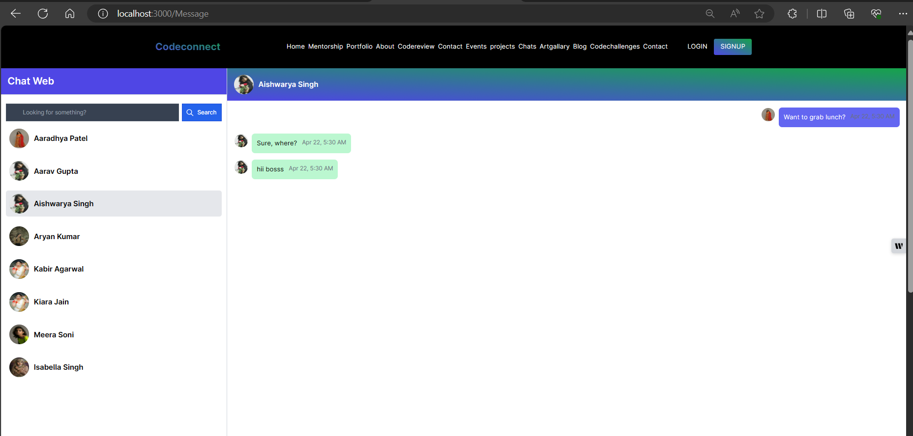
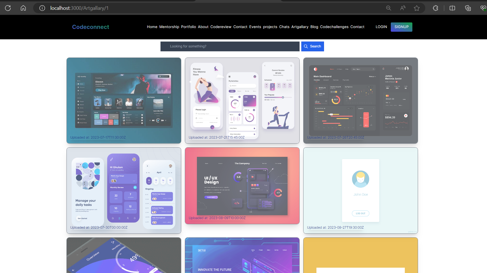

# CodeConnect--The-Ultimate-Social-Platform-for-Coders
CodeConnect is a cutting-edge social media platform designed exclusively for coders, developers, and tech enthusiasts. This innovative platform fosters collaboration, learning, and networking within the coding community.
[View PDF](DOCMAIN/Publishpaper.pdf)
| Main UI of Website                 | Login UI of Website                | Mentorship Matching UI of Website    |
| --------------------------------- | --------------------------------- | ----------------------------------- |
|           |           |             |

| Personal Portfolio UI of Website   | Code Review UI of Website          | Events UI of Website                |
| --------------------------------- | --------------------------------- | ----------------------------------- |
|           |           |             |

| Project Recommendation UI of Website | Messages UI of Website           | Art Gallery UI of Website            |
| ----------------------------------- | -------------------------------- | ----------------------------------- |
|          |         |           |

| Blogs UI of Website                | Code Challenge UI of Website      | Dashboard UI of Website             |
| --------------------------------- | -------------------------------- | ----------------------------------- |
|           |           |             |

